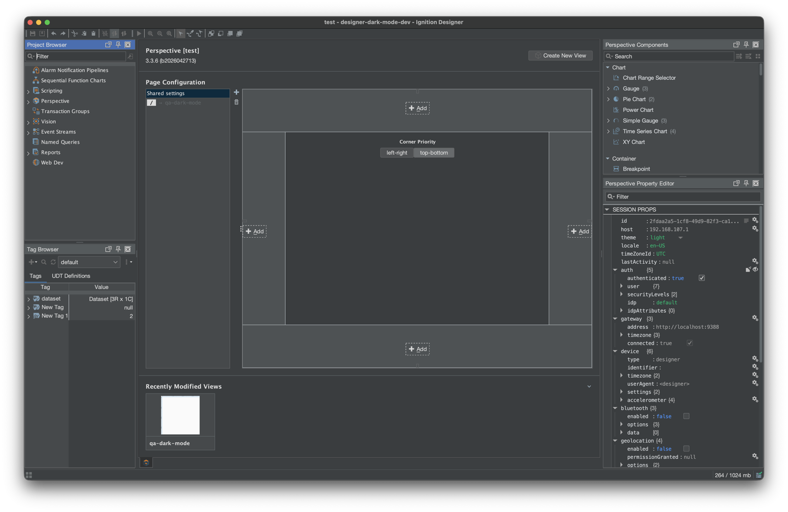
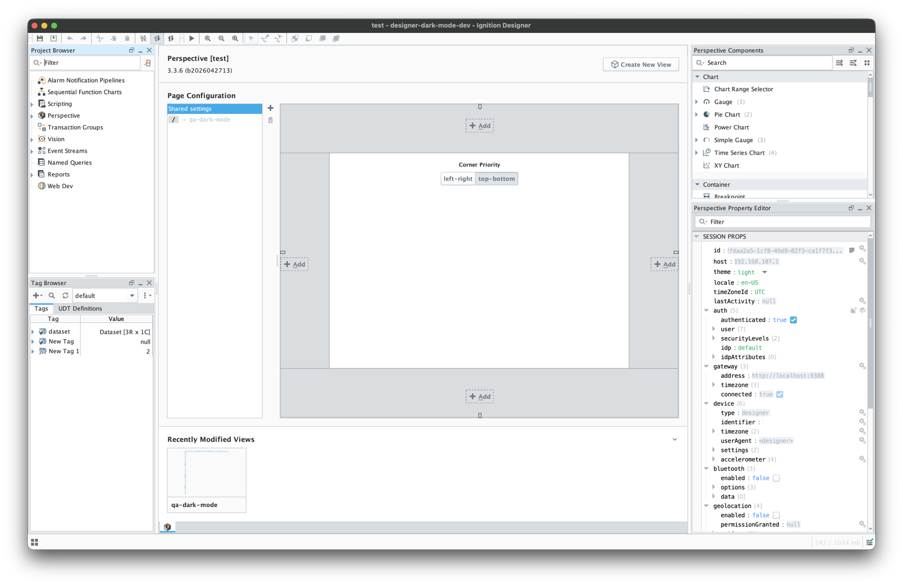

# Designer Dark Mode

A **dark mode** for the Ignition Designer, packaged as an Ignition module — the
most-requested Designer idea on Inductive Automation's ideas portal.



> Status: young but usable. Designer scope only; targets Ignition **8.3+**.
> See [Known limitations](#known-limitations) before installing.

## What it does

Ignition ships the Designer with a light, Synthetica-based look and feel and no
dark option. Designer Dark Mode adds a **Tools → Dark Mode** toggle that restyles the
whole Designer — dock panels, trees, tables, menus, the Perspective component
palette and property editor, the tag browser and tag editor, the script editors
and output console, dialogs, and icons — to a dark theme built on
[FlatLaf](https://www.formdev.com/flatlaf/). The choice is remembered between
sessions.

Toggling back restores the stock Designer. Relaunching always gives a clean
stock theme, whichever way you left it.

Because Ignition's own UI hard-codes many light colors in ways a normal look and
feel swap cannot reach, the module does substantial work under the hood to make
the theme comprehensive. See [docs/ARCHITECTURE.md](docs/ARCHITECTURE.md) if you
want to understand how, or extend it.

The same Designer, toggled off and on:

| Dark mode off | Dark mode on |
|---|---|
|  |  |

## Known limitations

- **A faint pale band** sits under the Tag Browser's `Tag | Value` header in
  dark mode
  ([#21](https://github.com/Mustry-Solutions/ignition-designer-dark-mode-module/issues/21)).
  Cosmetic, one panel.
- The Vision design canvas is deliberately left alone: it renders your own
  window content, and theming it would misrepresent what your users will see.

The open issue is cosmetic. It affects neither the Designer's behaviour nor
anything you build with it.

## Install

Grab a built `.modl` (see [Build](#build)) and install it on your gateway:
**Config → Modules → Install or Upgrade a Module** in the Gateway web UI, then
relaunch the Designer. The module is unsigned by default, so an 8.3 gateway will
ask you to accept it during install.

Then, in the Designer: **Tools → Dark Mode**.

## Build

Requirements: **JDK 17** (the Gradle toolchain will use it) and internet access
to Inductive Automation's Maven repository. Everything else — Gradle 8.14, the
module plugin, FlatLaf — is resolved automatically.

```bash
./gradlew build
```

The module lands at `build/designer-dark-mode.unsigned.modl`. Builds are unsigned
unless you pass signing credentials (see
[docs/DEVELOPMENT.md](docs/DEVELOPMENT.md#signing)).

## Try it in a throwaway gateway

The `ops/` scripts spin up a disposable Ignition gateway in Docker with the
module staged, so you can iterate without touching a real gateway:

```bash
ops/setup.sh      # build, start the gateway with the module staged
ops/deploy.sh     # rebuild + reload after code changes
ops/teardown.sh   # stop it (--purge also wipes gateway data)
```

Requires Docker. Full details in [ops/README.md](ops/README.md).

## Project layout

```
build.gradle.kts            Module definition (id, scopes, hook, signing)
settings.gradle             Gradle project + IA Maven repositories
designer/                   The only scope: Designer-side code
  build.gradle.kts          Designer deps (FlatLaf bundled via modlImplementation)
  src/main/java/.../designer/
    DesignerDarkModeHook     Module entry point; registers the Tools menu item
    ThemeManager             Orchestrates the whole theme switch
    IaColorTokens            Reflectively restyles Ignition's hard-coded colors
    TreeIconRecolorer        Dark-adapts tree icons and cell renderers
    CellRendererSanitizer    Dark-adapts table/list cells and renderer delegates
    ScriptEditorTheme        Applies Ignition's own dark theme to the code editors
    ConsoleTextTheme         Recolours the console output styles
    ComponentInspector       Debug tool: dumps the component under the cursor
    DebugLog                 Append-only debug log
    MoonIcon                 The menu item's icon
  src/main/resources/.../    Bundle strings (menu/action labels)
ops/                        Disposable Docker gateway for local testing
docs/                       Architecture and development guides
```

## Documentation

- **[docs/ARCHITECTURE.md](docs/ARCHITECTURE.md)** — how the dark theme is
  applied, why it takes so much machinery, and the Ignition implementation
  details it depends on. Read this before changing theming code.
- **[docs/DEVELOPMENT.md](docs/DEVELOPMENT.md)** — build, run, deploy, debug, and
  sign; the diagnostic tools; how to fix a "still light" component.
- **[ops/README.md](ops/README.md)** — the local dev gateway.

## Prior art

Inductive Automation's Exchange already has a
[Dark Mode for the Designer](https://inductiveautomation.com/exchange/2719/overview)
by Justin Edwards — a well-polished Jython script, MIT licensed, that has been
serving this need on **Ignition 8.1** since 2024. If you are on 8.1, use it.

Designer Dark Mode differs in two ways. It targets **8.3**, and it is a module
rather than a project-library script, so it installs once on the gateway
instead of being imported into each project and needs no Vision client tag to
persist. Under the hood it swaps the Designer's look and feel for
[FlatLaf](https://www.formdev.com/flatlaf/) and restyles Ignition's own design
tokens, rather than painting enumerated components one class at a time — which
means surfaces nobody has explicitly catalogued come out dark by default.

That script's careful catalogue of where the Designer leaks light informed this
project's testing, and is gratefully acknowledged.

## Contributing

Bug reports and pull requests are welcome — see
[CONTRIBUTING.md](CONTRIBUTING.md). Security issues should go through the
private channels in [SECURITY.md](SECURITY.md) rather than a public issue.

## Licensing & support

Licensed under the **Apache License, Version 2.0** — see [LICENSE](LICENSE).

The module is **free**: no trial period, no activation, no per-seat or
per-gateway fee, and it may be installed on any number of gateways. Bundled
third-party components are listed in
[THIRD-PARTY-NOTICES.md](THIRD-PARTY-NOTICES.md).

Designer Dark Mode is an independent third-party module. It is not produced,
endorsed, supported, or certified by Inductive Automation, LLC. "Ignition",
"Perspective" and "Vision" are trademarks of Inductive Automation, LLC, used
here only to identify the software this module interoperates with.

There is no commercial support contract. Please raise questions and bugs as
[GitHub issues](https://github.com/Mustry-Solutions/ignition-designer-dark-mode-module/issues).
